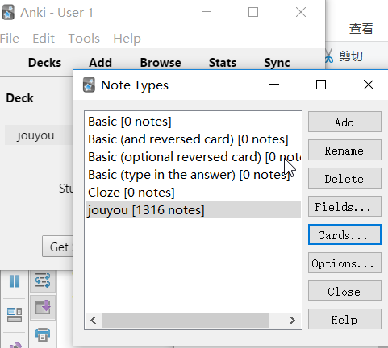
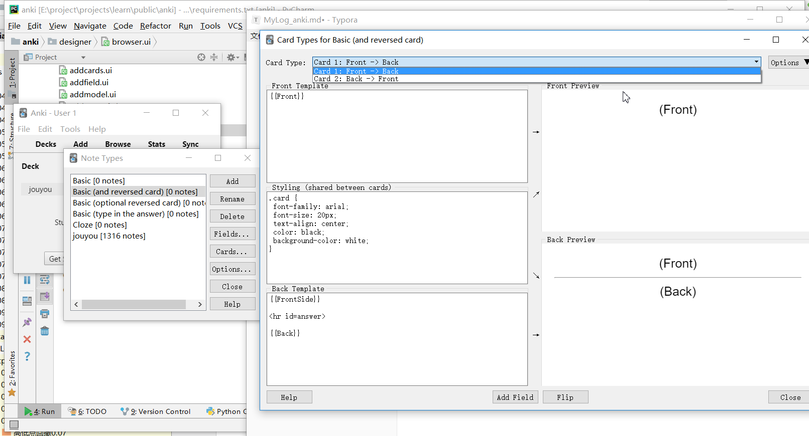
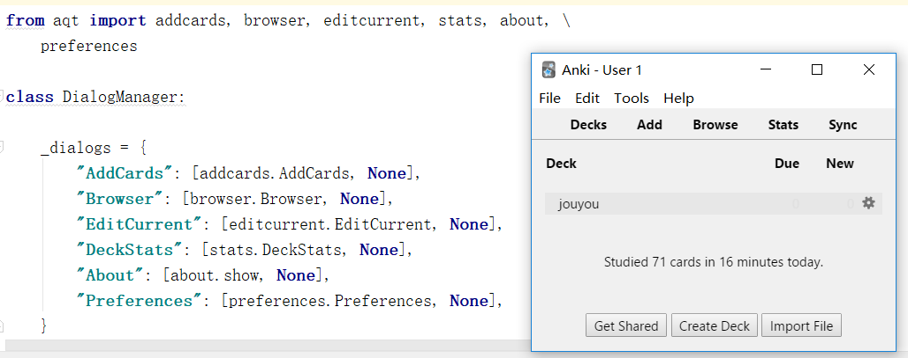

### 1 目录结构 & 测试代码

anki目录下没有gui成分。aqt下含有gui成分。

`/home/qian/project/learn/public/anki/tools/tests.sh`可以指定测试tests下某个文件（里面都是test开头的函数，没有`__main__`)

```bash
(venv) ➜  anki git:(master) ✗ ls tools
anki-wait.bat  build_ui.sh  runanki.system.in  tests.sh
(venv) ➜  anki git:(master) ✗ tools/tests.sh 
Call with coverage=1 to run coverage tests
tools/tests.sh: line 31: nosetests: command not found
```

the hard way中的execise中提到[nosetests - zofia_enjoy的博客 - CSDN博客](https://blog.csdn.net/zofia_enjoy/article/details/72594185)

nose官网已经废弃 [Note to Users — nose 1.3.7 documentation](https://nose.readthedocs.io/en/latest/)

> Nose has been in maintenance mode for the past several years and will likely cease without a new person/team to take over maintainership. New projects should consider using [Nose2](https://github.com/nose-devs/nose2), [py.test](http://pytest.org/), or just plain unittest/unittest2.

```bash
pip install nose

(venv) ➜  anki git:(master) ✗ which nosetests
/home/qian/project/learn/public/anki/venv/bin/nosetests
```

印象：没有引号、双引号都能展开$，甚至有x$x这种类似拼接字符串的效果。

启发

```
BIN="$(cd "`dirname "$0"`"; pwd)"
export PYTHONPATH=${BIN}/..:${PYTHONPATH}
```

[Shell 教程 | 菜鸟教程](http://www.runoob.com/linux/linux-shell.html)

`export PYTHONPATH=.`这样sys.path第二个总是当前目录的绝对路径，没用。

export PYTHONPATH=`pwd`

`git remote add -h`

### 2 调试，大致了解对象层次

vscode中创建main.py，启动调试。Debug console输出

```
➜  anki git:(master) ✗ cd /home/qian/project/learn/public/anki ; env "PYTHONIOENCODING=UTF-8" "PYTHONUNBUFFERED=1" python /home/qian/.vscode/extensions/ms-python.python-2018.9.2/pythonFiles/experimental/ptvsd_launcher.py 38212 /home/qian/project/learn/public/anki/tests/main.py
```

```
def Collection(path, lock=True, server=False, sync=True, log=False):
	db = DB(path)   # path是后缀名为anki2的文件路径
```

storage.py中的Collection函数

1. 连接数据库db
2. 返回collection.py中的_Collection对象。`col = _Collection(db, server, log)`

_Collection构造函数中

```python
        self.media = MediaManager(self, server)
        self.models = ModelManager(self)
        self.decks = DeckManager(self)
        self.tags = TagManager(self)
```

其中的XXManager来自xx.py

DB类的_db适配了sqlite3.Connections

deck是_Collection

综上，collection.py的_Collection是入点。

收获：对象的层层管理

### 3 查看note的过程

deck生成note，使用不同flag预览note的不同card。

```
deck = getEmptyCol()
f = deck.newNote()
# all templates
cards = deck.previewCards(f, 2)
```

在collection.py的Outline中输入Note查找

collection的addNote、rmNotes实际上是新增、删除跟note相关的card。

```python
def newNote(self, forDeck=True):
        "Return a new note with the current model."
        return anki.notes.Note(self,self.models.current(forDeck))
```


全局搜索newNode。

除了在tests函数中，另外在addcards.py、models.py中调用，两个都在aqt中。2018-11-06 17:08:38

### 3 单步调试GUI启动过程

解压apkg文件后

```bash
➜  anki tree
.
├── jouyou.apkg
└── jouyou.apkg_FILES
    ├── 0
    ├── collection.anki2
    └── media
```

导入时，注意到涉及~/.local文件夹。

调试runanki。

在aqt/init中

```python
# profile manager
    from aqt.profiles import ProfileManager
    pm = ProfileManager(opts.base)
```

opts.base默认为空字符。ProfileManager区分不同平台，Linux下为

```python
dataDir = os.environ.get(
                "XDG_DATA_HOME", os.path.expanduser("~/.local/share"))
```

然后实例化`class AnkiApp(QApplication):`

检查一些设置后，创建aqt/main.py中的主窗口`mw = aqt.main.AnkiQt(app, pm, opts, args)`

执行到`app.exec`启动的窗口的初始界面上，已经含有deck。应该是在上面窗口的创建过程中已经读取了。

init函数中主要执行两个函数

1. setupUI，setupUI中调用各种setup方法。
2. setupProfile。调用链：loadProfile 》 loadCollection 》_loadCollection

```python
    def _loadCollection(self):
        cpath = self.pm.collectionPath()

        self.col = Collection(cpath, log=True)
```

### 4 查看anki2文件

2018-11-07 10:43:58 sqlitebrowser中查看jouyou.anki2。注意到有Paragrma。表、表字段都要schema。

数据集中card、note两个表。note中的csum都是很大的数字。card中的did不知何意，看到的值都一样。

sqlitebrowser用Qt5写成，有表格、图表。2018-11-07 10:50:44

### 5 探索web与PyQt的交互

anki web上点`Basic phone mode`调到`Simple Study Mode`

尝试观察html、网络请求。

web版切换卡片后，右上角的数字可能不会立即更新。对数字颜色、含义不解。

"Show Answer" > reiviewer.py > 

嵌入了html和事件调用，追溯到web里的reviewer.js里的pycmd('ans')

webviwe.py中`AnkiWebPage(QWebEnginePage):`中

```python
script = QWebEngineScript()
        script.setSourceCode(js + '''
            var pycmd;
```

调试，窗口没出现前，setupUI》setupMainWindow，完成了绑定

窗口出现口，sync进度条跳过后，出现主窗口，空白。

此时cmd是domDone

```
_onBridgeCmd (/home/qian/project/learn/public/anki/aqt/webview.py:334)
_onCmd (/home/qian/project/learn/public/anki/aqt/webview.py:85)
cmd (/home/qian/project/learn/public/anki/aqt/webview.py:27)
_run (/home/qian/project/learn/public/anki/aqt/__init__.py:347)
run (/home/qian/project/learn/public/anki/aqt/__init__.py:262)
<module> (/home/qian/project/learn/public/anki/runanki:4)
```

看见首页前，出现了好像4词domDone

点deck名，cmd是'open:1541609815897'，接着又出现domDone

进入deck页。点”Study Now"，cmd是study

两次domDone后，显示卡片首页。（期间窗口空白）

“Show Answer”，cmd是“ans”，按钮点击状态下阻塞

看不出来怎么跳过去的

```
_linkHandler (/home/qian/project/learn/public/anki/aqt/reviewer.py:286)
_onBridgeCmd (/home/qian/project/learn/public/anki/aqt/webview.py:346)
_onCmd (/home/qian/project/learn/public/anki/aqt/webview.py:85)
cmd (/home/qian/project/learn/public/anki/aqt/webview.py:27)
_run (/home/qian/project/learn/public/anki/aqt/__init__.py:347)
run (/home/qian/project/learn/public/anki/aqt/__init__.py:262)
<module> (/home/qian/project/learn/public/anki/runanki:4)
```

继续进入，生成js，最终在webviews中eval生成的js更新页面。

点了‘Again'按钮，ease1

```python
def _linkHandler(self, url):
        if url == "ans":
            self._getTypedAnswer()
        elif url.startswith("ease"):
            self._answerCard(int(url[4:]))
        elif url == "edit":
            self.mw.onEditCurrent()
        elif url == "more":
            self.showContextMenu()
        else:
            print("unrecognized anki link:", url)
```

### 6 探索card类型

2018-11-10 11:11:24
结论：

* card处于3种类型：new learning review，对应GUI上并排的蓝、红、绿三个数字。当前类型通过对应数字下方的下划线指示。
* 两边的数字（new和review类型）不断减小，中间的数字不断增大
  * study过程中看卡片不会修改卡片的信息，就像在其他地方preview卡片一样
  * new卡片处于第一step。不管按什么按钮new数量都会减1。
    * 按again文档上说是move back to the first step，中间数字加2
    * 按good后，卡片到step2，中间数字加1
    * 按easy后，中间数字不变，安排到以后的review。
  * review是学习过、今天到期的card。
    * 按again后变成relearn。中间的数字会加1
    * learning状态不管按什么按钮，不会导致review数量改变

2018-11-10 11:28:12

过程回忆：在AnkiDroid上学习卡片，观察数字变化，没完全摸透，想起以前隔了很长时间再用也搞不清，用久了熟悉了又没总结，现在又忘了。观察ankidroid的统计，注意到learn、relearn的区别，看ankidroid的文档，后来又看anki的文档。

问题之处：

* 看到卡片、卡片状态、状态变换。后来意识到只看不会改变卡片，新卡片也有状态。
* 怎么保存状态，数据库记了哪些。现在还不清楚。联想：调度、运行时计算、事先已经算好。

解决思路：看实现前自己尝试手写减少焦虑

### 7 windows上环境配置

结论：使用anaconda、python3.6、pyqt5.9、PyQt5-tools，在mysys2用修改过的sh脚本生成ui。

2018-11-10 11:45:04

`tools/build_ui.sh`需要Linux环境执行。README.development中提到windows下用git的bash。

想在git bash上启用anaconda的环境。

windows上anaconda快捷方式的目标`%windir%\System32\cmd.exe "/K" E:\project\Anaconda3\Scripts\activate.bat E:\project\Anaconda3`

调用了另一个bat脚本，看内容较复杂，放弃。

想把build_ui.sh转换成py脚本，没看懂

新建`tools/build_ui.mysis2.sh`，在MSYS2 MINGW 64-bit中`pacman -S perl`后可以执行脚本，生成ui成功。

脚本改动之处，可见在sh脚本中可以运行bat和exe

```bash
/e/project/Anaconda3/Library/bin/pyuic5.bat --from-imports $i -o $py
/e/project/Anaconda3/Library/bin/pyrcc5.exe designer/icons.qrc -o aqt/forms/icons_rc.p
```

在pycharm中打开，没建虚拟环境，选择anaconda的默认解释器，requirements里只需要额外安装pyaudio。

执行runanki时报错

```
ModuleNotFoundError: No module named 'PyQt5.QtWebEngineWidgets'
```

自带的pyqt v5.6，查到说要更新的版本才有这个模块。

anaconda navigator看到pyqt可以升级，但是还是v5.6，点升级也没响应。另外网上，看到v5.6已经有了QtWebEngineWidgets模块。

改用虚拟环境。发现文档中提到pyqt版本5.9

```bash
pip install -r requirements.txt -i https://pypi.tuna.tsinghua.edu.cn/simple/
pip install pyqt5==5.9 -i https://pypi.tuna.tsinghua.edu.cn/simple/
```

pyaudio安装时报错

```
Exception:
Traceback (most recent call last):
  File "E:\project\projects\learn\public\anki\venv\lib\site-packages\pip-9.0.1-py3.7.egg\pip\compat\__init__.py", line 73, in console_to_str
    return s.decode(sys.__stdout__.encoding)
UnicodeDecodeError: 'utf-8' codec can't decode byte 0xc1 in position 211: invalid start byte
```

搜到的原因说windows控制台编码造成的。

在mysys中venv/Scripts/activate.bat无效，可以source venv/Scripts/activate，出现(venv)，但是进入python没有响应。

mysys2中pip install pyaudio，调用了vc编辑器，缺头文件

```
    src/_portaudiomodule.c(29): fatal error C1083: ▒޷▒▒򿪰▒▒▒▒ļ▒: ▒▒portaudio.h▒▒: No such file or directory
```

官网上提供的wheel缺少python3.7的

> - pip will fetch and install PyAudio wheels (prepackaged binaries). Currently, there are wheels compatible with the[official distributions](http://www.python.org/) of Python 2.7, 3.4, 3.5, and 3.6. For those versions, both 32-bit and 64-bit wheels are available.

[PyAudio: PortAudio v19 Python Bindings](http://people.csail.mit.edu/hubert/pyaudio/)

决定还是切回到3.6。中止。

发现[python升级到3.7版本安装pyaudio - zhl555666的博客 - CSDN博客](https://blog.csdn.net/zhl555666/article/details/82947654)

release中有whl文件

pip install whl文件，报错`PyAudio-0.2.11-cp37-cp37m-win_amd64.whl is not a supported wheel on this platform.`

参照[Python——pip安装报错：is not a supported wheel on this platform - 周小董 - CSDN博客](https://blog.csdn.net/xc_zhou/article/details/80851677)改名，装上

报错，少包

```python
from anki.utils import isWin
if isWin:
    import win32file, win32pipe, pywintypes, winerror
```

安装`pip install pywin32`

pyaudio中又报错

```
  File "E:\project\projects\learn\public\anki\venv\lib\site-packages\pyaudio.py", line 116, in <module>
    import _portaudio as pa
ModuleNotFoundError: No module named '_portaudio'
```

尝试用vs从源码编译

cmd、powershell中均报错

```
LINK : warning LNK4001: 未指定对象文件；已使用库
LINK : warning LNK4068: 未指定 /MACHINE；默认设置为 X86
LINK : fatal error LNK1159: 没有指定输出文件
error: command 'C:\\Program Files (x86)\\Microsoft Visual Studio\\2017\\Community\\VC\\Tools\\MSVC\\14.15.26726\\bin\\HostX86\\x86\\link.exe' failed with exit status 1159
```

放弃。准备改用anaconda，为了使用python3.6.

都用pip装上。~~pycharm中interpreter中看到了装好的包。但编辑器中依然显示缺pyaudio，启动时也是提示少pyaudio。~~

在命令行中能正常启动anki。~~在pycharm中还是提示少pyaudio，也启动不了。~~

pycharm中能正常启动，之前问题大概是没注意切换从venv切换到conda的env。

发现问题，首页显示比ubuntu上慢得多。

参照[PyQt5+Qt Designer - Hubz131的博客 - CSDN博客](https://blog.csdn.net/hubz131/article/details/79352443)，需要安装PyQt5-tools，安装后文件位于Lib\site-packages\pyqt5_tools

### 8 study过程按钮变化

relearn


new


默认都是good，按空格就行。new按again会很快再出现一次，可以用于确认觉得短期记忆，一共会出现3次，第一次看到、1m之内、10分钟。如果按good，10分钟内再出现一次。

### 9 note type

tools 》 manage note types



Deck中的jouyou可以拥有不同类型的note，不要与作为note type的jouyou混淆。

note type相当于vue中的组件、fields是数据，不同的是可以有多套template+style，称为不同的card type。如Basic(and reversed card) note type的cards...



`AnkiQt(QMainWindow).setupUI()`中`self.setupMainWindow`中`self.web = aqt.webview.AnkiWebView()`

`setupUI`方法最后

```python
# screens
self.setupDeckBrowser()  # 内部self._renderPage()在AnkiQt的web上渲染页面，在deckbrowser中有硬编码的html
self.setupOverview()
self.setupReviewer()
```

搜索stats页面上的文字定位到代码，ctrl+鼠标左键能显示用法，对流程有了模糊了解。

`aqt.dialogs`是aqt/init.py中的`dialogs = DialogManager()`



### 10 PyQt资料

[PyQt5 Reference Guide — PyQt 5.11.1 Reference Guide](http://pyqt.sourceforge.net/Docs/PyQt5/)

下载源码，[Riverbank | Software | PyQt | PyQt5 Download](https://www.riverbankcomputing.com/software/pyqt/download5/)，`"PyQt5_gpl-5.11.3\examples\qtdemo\qtdemo.py"`可以访问所有demo。

[PyQt5教程——介绍（1） - Archi - 博客园](https://www.cnblogs.com/archisama/p/5442071.html)

[Introduction · PyQt5 中文教程](https://maicss.gitbooks.io/pyqt5/content/)

### 11 ModelManager和stdmodels

打开anki。2018-11-13 16:17

> Your *collection* is all the material stored in Anki – your cards, notes, decks, note types, deck options, and so on.

`collection.py`中`_Collection`的`__init__`里`self.models = ModelManager(self)`，并列的还有`self.decks = DeckManager(self)`

`stdmodels.py`中可参考

```python
def addBasicModel(col):
    mm = col.models
    m = mm.new(_("Basic"))
    fm = mm.newField(_("Front"))
    mm.addField(m, fm)
    fm = mm.newField(_("Back"))
    mm.addField(m, fm)
    t = mm.newTemplate(_("Card 1"))
    t['qfmt'] = "{{"+_("Front")+"}}"
    t['afmt'] = "{{FrontSide}}\n\n<hr id=answer>\n\n"+"{{"+_("Back")+"}}"
    mm.addTemplate(m, t)
    mm.add(m)
    return m
```

几个函数在`storage.py`中的`Collection`的`__init__`里创建了`_Collection`的实例`col`后调用。创建实例`col`之前根据传入的参数path连接数据库db，作为参数传入`col`。2018-11-13 16:57:50

### 12 调试test_cards.py

启动code前，在终端中应该就先把当前目录放到PYTHONPATH中。2018-11-13 17:10:19

getEmptyCol在tmp目录下创建空文件，只要文件名，删了空文件，新建同名数据库，作为母本。每次拿的都是拷贝的副本。

```python
def newNote(self, forDeck=True):
        "Return a new note with the current model."
        return anki.notes.Note(self, self.models.current(forDeck))
```

```python
    def selected(self):
        "The currently selected did."
        return self.col.conf['curDeck']
```

```
selected (/home/qian/project/learn/public/anki/anki/decks.py:451)
current (/home/qian/project/learn/public/anki/anki/decks.py:454)
current (/home/qian/project/learn/public/anki/anki/models.py:108)
newNote (/home/qian/project/learn/public/anki/anki/collection.py:292)
test_previewCards (/home/qian/project/learn/public/anki/tests/test_cards.py:7)
card (/home/qian/project/learn/public/anki/tests/main.py:4)
<module> (/home/qian/project/learn/public/anki/tests/main.py:7)
```

调用栈返回到newNote中进入Node的`__init__`

Note类重写了

```python
    def __setitem__(self, key, value):
        self.fields[self._fieldOrd(key)] = value
```

```python
def test_previewCards():
    deck = getEmptyCol()
    f = deck.newNote()
    f['Front'] = '1'
    f['Back'] = '2'
    # non-empty and active
    cards = deck.previewCards(f, 0)
```

在数据库中的col中看到dconf保存的json数据。2018-11-13 17:51:17

[DB Browser for SQLite](http://sqlitebrowser.org/)

